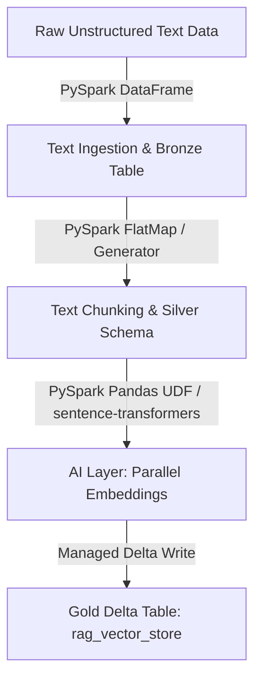

# RAG Data Pipeline on Databricks Community Edition

This implementation plan orchestrates an end-to-end Retrieval-Augmented Generation (RAG) data pipeline using PySpark, Spark SQL, and Databricks Delta Lake. The vector embeddings will be generated in parallel using a Spark Pandas UDF with `sentence-transformers/all-MiniLM-L6-v2`.

The system is designed to run on a single-node Databricks Community Edition cluster and is structured for seamless synchronization using Databricks Git Folders.

---

## Architecture Overview

The end-to-end pipeline consists of the following phases:
1. **Raw Ingestion (Landing Zone)**: Mock unstructured text documents ingested into a PySpark DataFrame representing a raw Bronze table.
2. **Text Chunking (ETL Layer)**: Splitting unstructured documents into overlapping semantic chunks (~500 characters with 50-character overlap) via a clean Python generator.
3. **Parallel Vectorization (AI/UDF Layer)**: Running a PySpark Pandas UDF (Vectorized UDF) to load `sentence-transformers/all-MiniLM-L6-v2` once per Python worker process (leveraging pandas batching) and generate dense vector embeddings (384-dimensional) in parallel.
4. **Managed Storage (Gold Layer)**: Saving the structured chunked data along with original text, metadata, chunk ID, and embeddings into a Delta Lake table.
5. **Documentation**: Providing inline demarcations where traditional ETL ends and AI starts, plus a detailed performance analysis document comparing Pandas UDF vs. standard UDF performance.

---

## User Review Required

> [!IMPORTANT]
> The target workspace subdirectory is located at: `C:\Users\KUNDAN\.gemini\antigravity\scratch\rag-pyspark-pipeline`.
> Please set this directory as your active workspace in your IDE if you haven't already.

---

## Proposed Changes

### Environment & Git Setup Component (Phase 1)

#### [NEW] [.gitignore](file:///C:/Users/KUNDAN/.gemini/antigravity/scratch/rag-pyspark-pipeline/.gitignore)
Create a comprehensive `.gitignore` file tailored for Python, PySpark, and Databricks:
- Ignores Python caches (`__pycache__`, `.pyc`, `.pyo`, `.pyd`)
- Ignores local environment files (`.env`, `.env.*`)
- Ignores Databricks-specific temporary directories and notebook metadata (`.ipynb_checkpoints`, `.databricks`)
- Ignores local IDE directories (`.vscode`, `.idea`)

---

### RAG Pipeline Generation Component (Phase 2)

#### [NEW] [rag_pipeline_notebook.py](file:///C:/Users/KUNDAN/.gemini/antigravity/scratch/rag-pyspark-pipeline/rag_pipeline_notebook.py)
A modular Python file formatted as a Databricks Notebook using standard `# COMMAND ----------` boundaries.

- **Cell 1**: Notebook environment initialization (`%pip install sentence-transformers`).
- **Cell 2**: Imports and SparkSession setup (for local testing compatibility).
- **Cell 3 (Bronze)**: Ingestion of mock unstructured technical documents into a Spark DataFrame.
- **Cell 4 (Silver)**: Text chunking logic using a generator. This splits documents into semantic windows of ~500 chars with a 50-char overlap.
- **Cell 5 (AI Layer Boundary)**: Defining the Schema and Pandas UDF for vectorization.
  - *Explicitly demarcates where standard ETL ends and AI starts.*
  - *Uses a Pandas Series-to-Series UDF (`pandas_udf`) to process text batches efficiently in PySpark.*
  - *Instantiates `SentenceTransformer` inside the UDF's batch loop or as a lazy-loaded singleton to avoid repeated disk loads.*
- **Cell 6 (Gold)**: Applying the UDF to generate embeddings and writing the resulting Spark DataFrame to a managed Delta Table: `default.rag_vector_store`.
- **Cell 7**: Verification query using Spark SQL to search/retrieve records.

---

### Documentation Component (Phase 3)

#### [NEW] [pandas_udf_performance_analysis.md](file:///C:/Users/KUNDAN/.gemini/antigravity/scratch/rag-pyspark-pipeline/pandas_udf_performance_analysis.md)
A comprehensive markdown analysis explaining:
- The fundamental performance issues with standard PySpark Row-by-Row UDFs (JVM-Python serialization overhead via Py4J, socket transfer costs, lack of vectorization).
- How Arrow-optimized Pandas UDFs (Apache Arrow integration) serialize data in batches using columnar format, drastically reducing transfer overhead.
- Why Pandas UDFs are critical for deep learning models: they load the embedding model (`sentence-transformers`) **once per worker/batch** rather than once per row, permitting batch inference on GPU/CPU (using sentence-transformers' internal PyTorch batching).
- Memory management considerations on single-node Databricks Community clusters (e.g., configuring `spark.sql.execution.arrow.maxRecordsPerBatch`).

---

## Verification Plan

### Automated Tests
- We will construct a validation script `validate_pipeline.py` that runs PySpark locally (if Java/Spark is available) or uses local Python verification to ensure:
  - Text chunking produces chunks within the target character bounds with correct overlap.
  - Embedding UDF correctly outputs a 384-dimensional vector array.
- We will verify Git repository setup by executing `git status` inside `C:\Users\KUNDAN\.gemini\antigravity\scratch\rag-pyspark-pipeline`.

### Manual Verification
- The generated `rag_pipeline_notebook.py` can be imported directly into Databricks Community Edition as a Git Folder or uploaded as a Python file.
- The user can run the notebook step-by-step to confirm the managed Delta Table is created and contains the expected dense vector embeddings.
